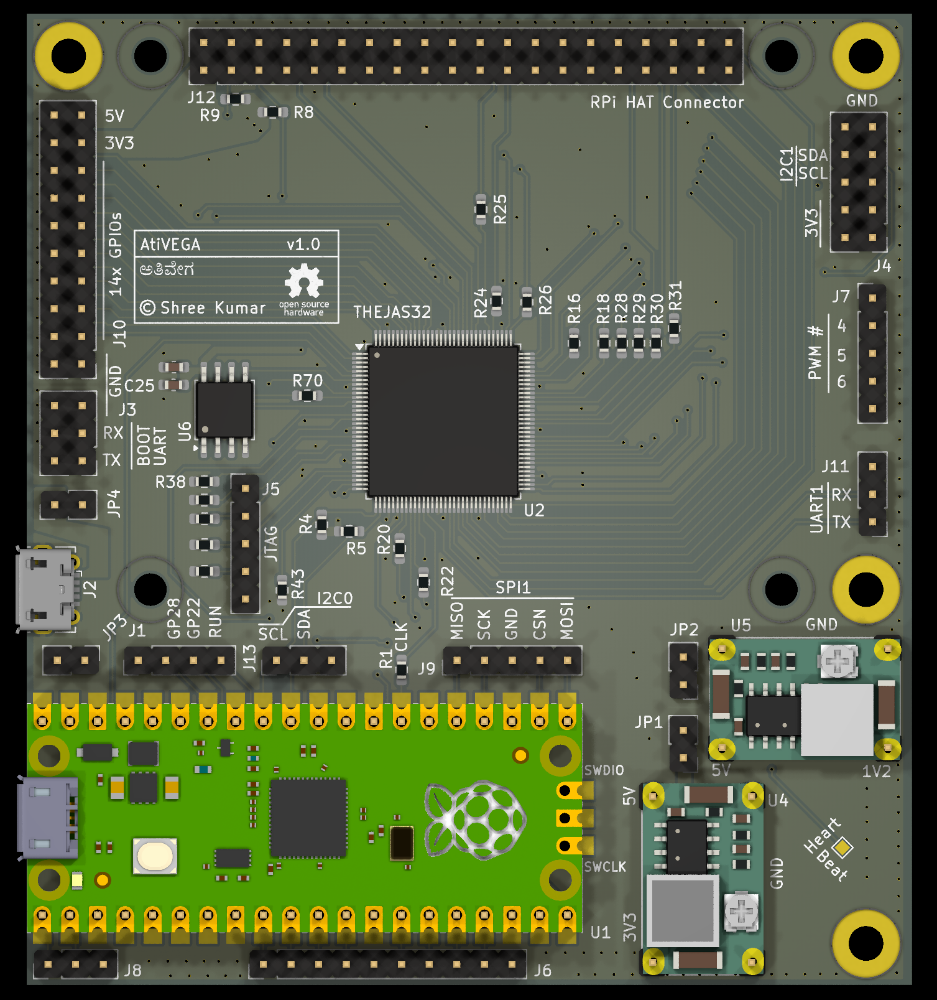

# Status

We're at v1.0, and the board is being tested out.

Do look at the respective directories for hardware and software.

#  Intro

CDAC sells the [ARIES series of boards](https://vegaprocessors.in/devboards/) based on the [THEJAS32 microcontroller](https://vegaprocessors.in/soc/).
The boards can be programmed using the Arduino IDE. Unfortunately, the schematics
of these are not made available.  Documentation about the THEJAS32 SoC itself
is scarce as well, though the chip itself is available for [purchase on robu.in
in single quantity](https://robu.in/product/thejas32-soc-based-microprocessor/).

This project (and follow on work) will try to fill this gap, as I find more.
This is a board design for a learner board based on the THEJAS32
microcontroller. It is the first open source board based on 
the THEJAS32. This is part of a much larger effort to document THEJAS32 
and its ecosystem and make it usuable.

THEJAS32 runs directly on an external clock, offering a single core 100
MHz RISC-V CPU with a IO interfaces - UART, SPI, I2C, PWM and GPIOs.

This board sets up THEJAS32 a test microcontroller, controlled by a Raspberry
Pi Pico.  Some of the IO interfaces are routed to the Pico.  This opens
the door for many types of experimentation and learning, including clock
control, timing, peripheral emulation, etc.  

Useful background and goals for this board are well covered in my [recent talk
at IndiaFOSS 2024](https://youtu.be/-m1KqcOkT5M?t=6345) (video, 25 mins). There
is also a [AtiVEGA hackaday project](https://hackaday.io/project/197724-ativega) page.
Look at hackaday for updates, what's going on in the project, etc.

A somewhat detailed background and intro to the
board is also in [this presentation at ChennaiFOSS 2024 conference](https://www.youtube.com/watch?v=wljsP2YMgHc)
(video, 25 minutes) that I gave earlier this year.

This board is designed to be a low cost board, relying on off-the-shelf components
as much as possible.  The goal is to encourage easy assembly without advanced
skills. For this reason, the smallest footprint chosen for passives is 0603.

# Design

The board consists of a few main elements

* THEJAS32 SoC
* 2 MB flash (used by THEJAS32)
* Raspberry Pi Pico
* 2x Mini 360 DC-DC power modules - one to generate core voltage of 1.2V, other for 3.3V

The core of the board consists of

* THEJAS32 SoC
* 2 MB flash

The power and boot cycle of the THEJAS32 ("MCU") is primarily controlled 
using a few pins

* active low RESET can be pulled up by Master Pico to get it out of reset
* System clock is generated from a GPOUT capable pin of the Pico. System 
  clock can thus be generated in many ways
* BOOT_SEL pin is controlled by Pico, allowing boot from SPI flash
  or UART.
* BOOT UART (UART0) is routed to Pico, enabling log capture and 
  programming

Pins and interfaces are broken out into standard 0.1" headers. Dual
row headers are mostly employed. When shorted, the interface gets routed from
the MCU to the RP2040. This enables advanced experimentation, precise timing,
peripheral emulation, co-processing, etc.

Board may be powered using the dedicated micro USB connector(J2) or through
the Pico.  Jumpers JP3 and JP4 decide the source of power. Both jumpers may
also be populated, allowing the Pico to function as a USB host, but care must
be taken not to connect Pico as a USB device in such cases. Refer to the schematic
for more info.

Precise measurement of power draw of the THEJAS32 is also a goal of this board. Jumpers JP2 and JP1 are included for this purpose.

# THEJAS32 IO

All IOs from THEJAS32 are broken out. Software can thus use all the pins. Some details are below; do refer the schematics for complete details.

## UART

Boot UART is available on J3. This can be sent to the Pico for control, by using two jumpers.

J11 breaks out UART1 from THEJAS32.

## Raspberry Pi HAT compatibility

Many Raspberry Pi HATs should be usable with this board, mounted on J12.
THEJAS32 does not have any pin multiplexing. The most commonly used 
functions on the various pins are thus directly assigned, including I2C,
SPI, UART and PWM and GPIOs. Refer the schematics for details.

A full size HAT can be mounted on this board. Additional through holes are 
provided to ensure mechanical support.

## GPIO Breakout

J10 features 14 GPIOs - GPIO17 to GPIO30. States for these can be set one shot, by bit masking.

## I2C and SPI

J4 breaks out I2C1 and SPI0.

J13 provides access to I2C0.  This is also connected to the Pico, for control. Pico can be setup as an I2C slave and respond to I2C transfers initiated by THEJAS32.

Similarly SPI1 is available on J9, also connected to SPI interface on Pico. Pico can be setup as a SPI slave, and respong to transfers initiated by THEJAS32.

## JTAG

J5 breaks out JTAG pins from THEJAS32.  Fun fact: none of the official ARIES boards break out JTAG.

## PWM

PWM pins 4,5,6 are broken out on J7. R32, R33 and R34 can be used to control the current.

# Raspberry Pi Pico

Pico controls the runtime lifecycle of the THEJAS32, via the RESET and CLK pins. BOOT_SEL is also under Pico's control. Note that the Pico is an integral part of the board design, as it provides the clock signal to THEJAS32.

J8 and J6 can be used to interface external electronics directly to Pico. J8 has the debug UART.

A single ADC pin, clock pin (GPIO22) are available as well.

# Tools

Based on KiCAD 8.

# Checkout Instructions

This project uses git submodules. To checkout everything, do:

    git clone --recurse-submodules https://github.com/shreekumar3d/thejas32-testbed.git

Raspberry Pi Pico footprint is a submodule.  If you don't go this, you'll not
see the nice Pico in the 3D preview.

# Credits

* [RPi Pico Symbool and Footprint](https://github.com/ncarandini/KiCad-RP-Pico)
* [Mini 360 Step Down Converter Footprint](https://github.com/rayvburn/KiCad)

