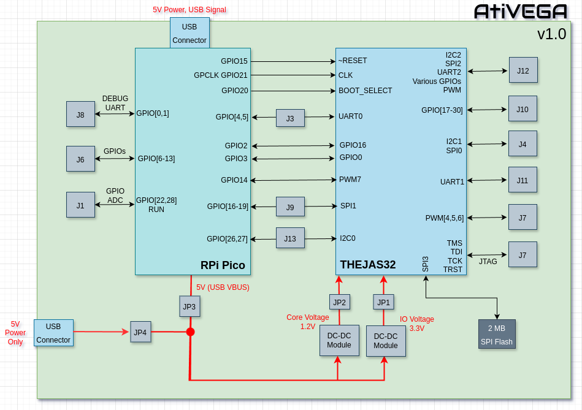

# AtiVEGA Board

AtiVEGA is designed with KiCAD 8. The entire design is available here - both schematics and layout. Plus complete documentation, design rationale, etc.

High quality documentation is an important goal for this project. Obscurity is not. [THEJAS32](https://vegaprocessors.in/soc/) is a bit of a black box, and this is the tool to demistify it, learn from it and understand hardware at various levels. If you have a question, feel free to ask!

The *raison d'etre* of this board is to serve as a learning board for RISC-V at the PCB (board) level, the ISA level and the sillicon level.  It is designed for desk usage.

Raspberry Pi Pico is chosen as the system master for its excellent documentation, flexibility, capabilities and high performance. It is wired as a coprocessor, enabling many use cases.

As of this writing (September 2024), this is the only open source board that includes the THEJAS32.  Not just that - it is the only known board apart from CDAC's [ARIES boards](https://vegaprocessors.in/devboards/).  It is also the only board that breaks out the JTAG signals - the ultimate attempt to demistify the *Sarkaari* SoC! Open source trumps RTI (Right to Information) - FTW!

THEJAS32 is abbreviated to T32 in the rest of the document.

## PCB Design

The PCB is designed, and choice of components, is made to ease manual assembly.  That said, T32 - the main microcontroller, or more accurately, the *device under test(DUT)* has a LQFP128 footprint - with its pins spaced 0.5mm apart.  This is typically solderable with the aid of a magnifier.  The board also uses relatively fine surface mount components - resistors and capacitors are 0603.  The flash IC is an easier SOIC-8.  Rest are all through hole components - mostly connectors, the Raspberry Pi Pico and the Mini360 DCDC Power Modules.

The design emphasizes modularity, and relies on locally procurable components.  The idea is that anybody should be able to just get the PCB and the components and assemble the board. I could have included DC-DC regulators on the board, but I have chosen not to.  I believe this allows you to experiment with ease. Some examples:

 1. T32's core voltage is 1.2V and IO voltage is 3.3V.  Upper and lower limits are not know (yet!). Using the trimpot on the DCDC modules, these voltages can be changed. Not only will this allow me to find the limits (expecting magic smoke *at-least* once!), but it also allows anyone to study things like impact of system clock on power consumption, leakage current, etc.
 2. [Raspberry Pi Pico](https://www.raspberrypi.com/documentation/microcontrollers/pico-series.html) is used by default, but the board isn't specific to it, as there are a few compatbile options.  Need WiFi ? Use Pico W ! Need more performance - there's the Pico 2 now! Pico 2's selectable RISC-V/ARM cores means you can benchmark and compare two RISC-V implementations on one board - the [Hazard3 - RV32IMACZb*](https://github.com/Wren6991/Hazard3) and [ET1031 on T32 - RV32IM](https://vegaprocessors.in/thejas32.php). How cool is that ?

The PCB is designed as a 4 layer PCB, with the following layers:

 1. Signal - Top Layer
 2. GND
 3. Power
 4. Signal - Bottom Layer

# Simplified Schematics

For illustration, here is a simplified schematic. Some components or connectors are omitted for brevity.  They are explained later, as required.

## Powering the Board

### Single Cable Operation

AtiVEGA can be powered by a single USB micro B cable, connected to the Pico. For this,

 1. Populate jumpers JP4, JP1 and JP2.
 2. Ensure JP3 is open

### Two Cable Operation

If you wish to measure the power consumed by the T32 section separately:

 1. Populate JP3, JP1 and JP2.
 2. Ensure JP4 is populated
 3. Connect both USB connectors to a host PC/5V power supply. Typically you would connect the Pico to a host PC for status monitoring, but this is strictly not essential.  You could choose to use J8 to monitor debug messages over UART.

Note that measuring power in series with JP3 will measure the power of T32, any components connected on the board (apart from the Pico), and it will include the overhead of the DCDC converters.

### Fine Grained Power Measurement

To avoid the DCDC connectors, you can connect a real power supply to the appropriate points on JP1(3.3V), JP2(1.2V) and JP3(5V).  This gives the most accurate power reading, at the cost of more equipment. Alternatively, just measure power in series using modules such as INA219.

## THEJAS32 <-> Pico

The Pico is the system master and a co-processor.  It is the first component on the board that powers on and becomes active.

The Pico is directly connected to T32's RESET_N, and CLK lines. GPIO21 is a GPCLK capable pin, and can drive T32's system clock at system clock speeds of the Pico - which is known to be massively overclockable...  How much can the T32 handle ?

T32 runs a bootloader from an internal bootrom (I am guessing, the bootrom part is not documented). The behaviour of this depends on the BOOT_SELECT line, which is controlled by the Pico.  If BOOT_SELECT is *low*, T32 loads code from the SPI flash (interface SPI3).  To support this, the board includes a 2MB SPI flash. If BOOT_SELECT is *high*, T32 boots from UART, using an XMODEM+CRC protocol.  T32's boot UART interface, UART0 is connected to GPIO4 and GPIO5 of the Pico, through the header JP3. This allows you to either tap out the lines for external examination, or route them to the Pico  the recommended default.

Note that irrespective of the state of BOOT_SELECT, T32 puts out the following fixed header over UART before taking action according to BOOT_SELECT.

    +-----------------------------------------------------------------------------+
    |           VEGA Series of Microprocessors Developed By C-DAC, INDIA          |
    |     Microprocessor Development Programme, Funded by MeitY, Govt. of India   |
    +-----------------------------------------------------------------------------+
    | Bootloader, ver 1.0.0 [  (hdg@cdac_tvm) Tue Dec  15 16:50:32 IST 2020 #135] |
    |                                                                             |
    |  ___    _________________________          ISA  : RISC-V [RV32IM]           |
    |  __ |  / /__  ____/_  ____/__    |                                          |
    |  __ | / /__  __/  _  / __ __  /| |         CPU  : VEGA ET1031               |
    |  __ |/ / _  /___  / /_/ / _  ___ |                                          |
    |  _____/  /_____/  \____/  /_/  |_|         SoC  : THEJAS32                  |
    +---------------------------------------+-------------------------------------+
    |         www.vegaprocessors.in         |             vega@cdac.in            |
    +---------------------------------------+-------------------------------------+

After T32 finishes booting, this UART can be used to communicate between the applications running on the T32 and the Pico.

GPIO[0,16] of T32 are routed to GPIO[2,3] of Pico.  These can be used to intimate each other of actions to be taken.  As a simple example, T32 could use GPIO0 to control the LED on the Pico, with the Pico's involvement. Similarly, the on-board button on the Pico could be used to take appropriate action on T32. Note that proper usage will require setting the appropriate direction on both sides of the GPIO.

T32's PWM7 pin is routed to Pico's GPIO14.  This can be used to test, validate and characterize the PWM capabilities of the T32.  Additionally, as a PWM with 100% duty cycle, it can be used as a GPIO output from T32 to Pico.

Similarly, T32's SPI1 and I2C0 interfaces are also routed to Pico.  T32's hardware interfaces are master only.  Luckily, Pico supports slave modes for both SPI and I2C. With appropriate software, Pico can even emulate actual hardware, and even initiate external action (over USB or WiFi/BT in case of Pico W).

Since the board uses standard headers, you can even use jumper wires to connect other IOs between Pico and T32.

Overall, many useful possibilities are created by these interconnections, and these  will be further explored in the 'sw' directory.

## External Hardware Connections to THEJAS32

### GPIOs

14 GPIOs - GPIO[17-30] are available on J10 (it also includes 3.3V, 5V and GND).

These GPIOs are chosen for a specific purpose - they are controlled by a single register, thus their states may be changed/sampled with a single instruction. 

When used as output, GPIO16 (connected to Pico) and GPIO31 (on the HAT connector) could also be impacted by the instruction, and appropriate care can be taken if needed.

### UART

T32's UART1 interface is routed to J11.

### I2C

T32's I2C1 interface is connected to J4.  Pull up resistors R6 and R7 are on the bottom side of the board.

### SPI

T32's SPI0 interface is routed to J4. Series resistors R16 and R18 for clock and MOSI line are placed close to T32 on the top side, for tuning, if necessary.

### PWM

3 PWM pins, PWM 4,5 and 6 are routed to J7. R32, R33 and R34 are series resistors on these lines. T32's pins support 12mA per IO pin, which is sufficient to drive LEDs. Ensure you use appropriate current limiting resistors, or replace the ones on the board.

### Raspberry Pi HAT compatibility

Raspberry Pi HATs can be plugged in to J12 and used. pHATs and full sized HATs are mechanically compatible.  For full sized HATs, two through holes are provided for mechanical support and grounding.

T32 does not have any kind of pin multiplexing.  Thus, this board cannot support all the pin multiplexing as implemented on a Raspberry Pi. That said, I have looked at the most common uses of the pins in HATs (from [pinout.xyz](https://pinout.xyz/)), and pins have been assigned to maximize compatibility.  Most commonly used functions on specific pins (I2C and SPI) have been included.

Here is the detailed pin mapping:

|RPi Pin Mapping   |T32 Pin  |HAT Pin No|HAT Pin No|T32 Pin |RPi Pin Mapping   |
|------------------|---------|----------|----------|--------|------------------|
|3V3 Power         |         |        1 |        2 |        |5V Power          |
|GPIO 2(I2C1 SDA)  |I2C2_SDA |        3 |        4 |        |5V Power          |
|GPIO 3(I2C1 SCL)  |I2C2_SCL |        5 |        6 |        |Ground            |
|GPIO 4(GPCLK0)    |GPIO 31  |        7 |        8 |UART2_TX|GPIO 14(UART TX)  |
|Ground            |         |        9 |       10 |UART2_RX|GPIO 15(UART RX)  |
|GPIO 17           |GPIO 1   |       11 |       12 |PWM0    |GPIO 18(PCM CLK)  |
|GPIO 27           |GPIO 2   |       13 |       14 |        |Ground            |
|GPIO 22           |GPIO 3   |       15 |       16 |GPIO 4  |GPIO 23           |
|3V3 Power         |         |       17 |       18 |GPIO 5  |GPIO 24           |
|GPIO 10(SPI0 MOSI)|SPI2_MOSI|       19 |       20 |        |Ground            |
|GPIO 9(SPI0 MISO) |SPI2_MISO|       21 |       22 |GPIO 6  |GPIO 25           |
|GPIO 11(SPI0 SCLK)|SPI2_CLK |       23 |       24 |SPI2_CSN|GPIO 8(SPI0 CE0)  |
|Ground            |         |       25 |       26 |GPIO 7  |GPIO 7(SPI0 CE1)  |
|GPIO 0(EEPROM SDA)|GPIO 8   |       27 |       28 |GPIO 9  |GPIO 1(EEPROM SCL)|
|GPIO 5            |GPIO 10  |       29 |       30 |        |Ground            |
|GPIO 6            |GPIO 11  |       31 |       32 |PWM1    |GPIO 12(PWM0)     |
|GPIO 13(PWM1)     |PWM2     |       33 |       34 |        |Ground            |
|GPIO 19(PCM FS)   |PWM3     |       35 |       36 |GPIO 12 |GPIO 16           |
|GPIO 26           |GPIO 13  |       37 |       38 |GPIO 14 |GPIO 20(PCM DIN)  |
|Ground            |         |       39 |       40 |GPIO 15 |GPIO 21(PCM DOUT) |

HAT's EEPROM SDA and SCL are connected to T32 GPIO 8 and 9. I am not sure if EEPROM is used extensively.  If required, I2C access would need to be achieved via bit banging these pins. There are no pull-up options on the board to facilitate this, though. Should be enough for EEPROM, though.

A large number of HATs/pHATs use I2C, and some use SPI (common for displays). These should be largely compatible.  For a complete compatibility list, check the end of this document.

## External Hardware Connections to Pico

Unused pins on the Pico are broken out into specific headers to ease interfacing with external hardware.

### Debug UART

Pico's GPIO0 and 1 are connected to J8.  These are typically used as the debug UART pins on the Pico - supported by hardware uart0.

### GPIOs

8 GPIOs - GPIO 6-13 are routed to J6, with their pins directly in-line with the Pico. These can be used to interface external hardware in any number of flexible ways.

Similarly, GPIO22 and GPIO28 are routed to J1.

### ADC

Pico's GPIO28 can be used as an ADC pin - and it is broken out to J1.

# RPi HAT/pHAT Compatibility

Here is a hardware compatibility table for HATs from [pinout.xyz](https://pinout.xyz).

Note that this is not an indicator of software support.  The Tested column should be your definitive guide.  If you test something and it works, do let me know!

I have a few HATs and pHATs, which I will test and update below. This table mostly reflects grunt work I do that I don't want to waste.

|SN |Manufacturer     |HAT Name                                 |Form Factor|Compatible|Tested?|Notes                              |
|---|-----------------|-----------------------------------------|-----------|----------|-------|-----------------------------------|
|1  |AB Electronics UK|1 Wire Pi Plus                           |HAT        |Yes       |       |                                   |
|2  |AB Electronics UK|1 Wire Pi Zero                           |pHAT       |Yes       |       |                                   |
|3  |Adafruit         |16x2 Character LCD                       |pHAT       |Yes       |       |                                   |
|4  |Waveshare        |2.13 Inch E-Ink Display pHAT             |pHAT       |Yes       |       |                                   |
|5  |PlasmaDan        |30 A Relay HAT                           |HAT        |Yes       |       |                                   |
|6  |PiHut            |3D XMAS Tree                             |HAT        |No        |       |                                   |
|7  |Sixfab           |3G/4G/LTE Base Shield                    |HAT        |Yes       |       |                                   |
|8  |Sixfab           |3G/4G/LTE Base Shield V2                 |HAT        |No        |       |UART pin mismatch                  |
|9  |AB Electronics UK|ADC Differential Pi                      |pHAT       |Yes       |       |                                   |
|10 |AB Electronics UK|ADC Pi                                   |pHAT       |Yes       |       |                                   |
|11 |AB Electronics UK|ADC-DAC Pi Zero                          |pHAT       |Yes       |       |                                   |
|12 |Google           |AIY Vision Bonnet                        |pHAT       |Unknown   |       |Check again                        |
|13 |Google           |AIY Voice Bonnet                         |pHAT       |No        |       |No I2S support                     |
|14 |Google           |AIY Voice HAT                            |HAT        |No        |       |No I2S support                     |
|15 |JustBoom         |Amp HAT                                  |HAT        |No        |       |No I2S support                     |
|16 |JustBoom         |Amp Zero                                 |pHAT       |No        |       |No I2S support                     |
|17 |RasPIO           |Analog Zero                              |pHAT       |Yes       |       |                                   |
|18 |PlasmaDan        |Appliance HAT                            |HAT        |Yes       |       |                                   |
|19 |PlasmaDan        |Appliance HAT Mini                       |pHAT       |Yes       |       |                                   |
|20 |Adafruit         |Arcade Bonnet                            |pHAT       |No        |       |No I2S support                     |
|21 |Pimoroni         |Audio Amp SHIM                           |pHAT       |No        |       |No I2S support                     |
|22 |Pimoroni         |Automation HAT                           |HAT        |Possible  |       |Use PWM as GPIO                    |
|23 |Pimoroni         |Blinkt!                                  |pHAT       |No        |       |Check again                        |
|24 |Pimoroni         |Breakout Garden HAT                      |HAT        |Yes       |       |Check again                        |
|25 |Pimoroni         |Breakout Button SHIM                     |pHAT       |Yes       |       |                                   |
|26 |PiHut            |CamJam EduKit 3 motor controller board   |pHAT       |Yes       |       |Check GPIO usage                   |
|27 |Josip Medved     |Canaka                                   |HAT        |Yes       |       |                                   |
|28 |Adafruit         |Capacitive Touch HAT                     |HAT        |Yes       |       |                                   |
|29 |Paser            |Carberry                                 |HAT        |No        |       |LIRC pin                           |
|30 |Sixfab           |Raspberry Pi Cellular IoT Application HAT|HAT        |No        |       |UART pin mismatch                  |
|31 |ModMyPi          |Christmas Tree Star                      |           |No        |       |SPI pins can't be used as GPIO     |
|32 |Element14        |Cirrus Logic Audio Card                  |HAT        |No        |       |No audio support                   |
|33 |Google           |Coral Environment Sensing Board          |pHAT       |No        |       |PWM pin can't be used as GPIO input|
|34 |PlasmaDan        |CTRL HAT                                 |HAT        |Yes       |       |                                   |
|35 |4tronix          |cube:bit Base                            |HAT        |No        |       |PWM pin can't do neopixel timing   |
|36 |JustBoom         |DAC HAT                                  |HAT        |No        |       |No audio support                   |
|37 |JustBoom         |DAC Zero                                 |pHAT       |No        |       |No audio support                   |
|38 |Adafruit         |DC & Stepper Motor HAT                   |HAT        |Yes       |       |                                   |
|39 |Raspihats        |DI6acDQ6rly I2C-HAT                      |HAT        |Yes       |       |                                   |
|40 |JustBoom         |Digi HAT                                 |HAT        |No        |       |No audio support                   |
|41 |JustBoom         |Digi Zero                                |pHAT       |No        |       |No audio support                   |
|42 |Kertatuote       |Disco HAT                                |           |No        |       |PWM pin can't be used as GPIO input|
|43 |Pimoroni         |Display HAT Mini                         |pHAT       |Maybe     |       |Use GPIO 7 as SPI CS               |
|44 |                 |                                         |           |          |       |                                   |

