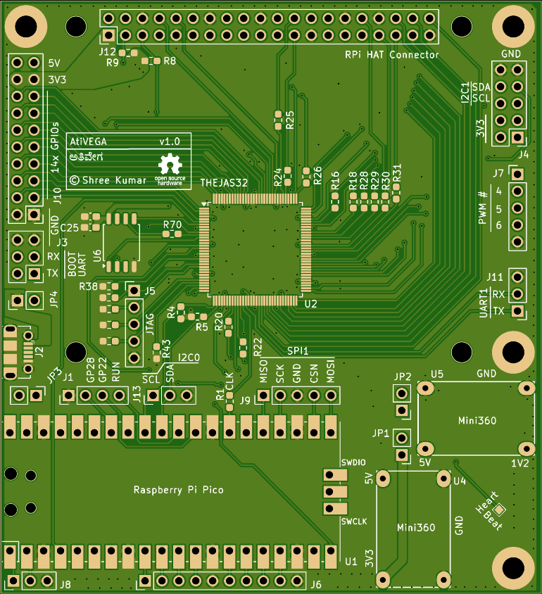
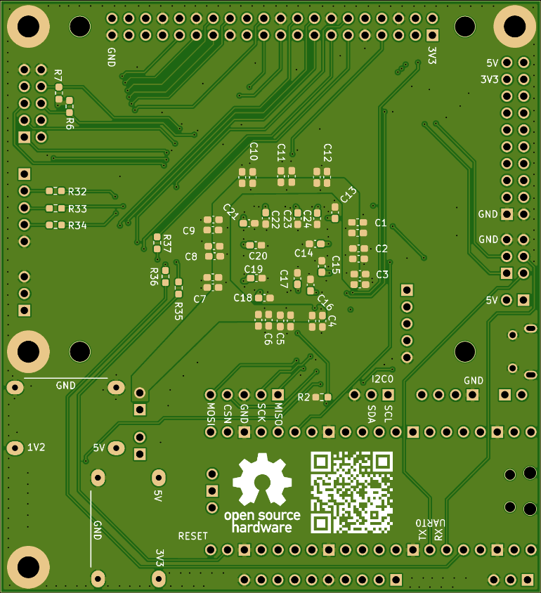

This is the first gerber release to production.

I am excited as this will be my second personal PCB, ever! The first one was an
automatic water control design for drip irrigation, built with the MSP430.

After some comparisons, I ended up using JLCPCB for the manufacturing. Gave them
ativega-v1.zip. Opted for impedance control, and no marks on the PCB. Also
included the production confirmation for peace of mind.

The top view, bottom view of the PCB generated by JLCPCB, as well as the
manufacturing gerbers are in the corresponding directory.

The first batch is 10 boards. $30.90 for boards, $35.20 for shipping, totalling
$66.10.

