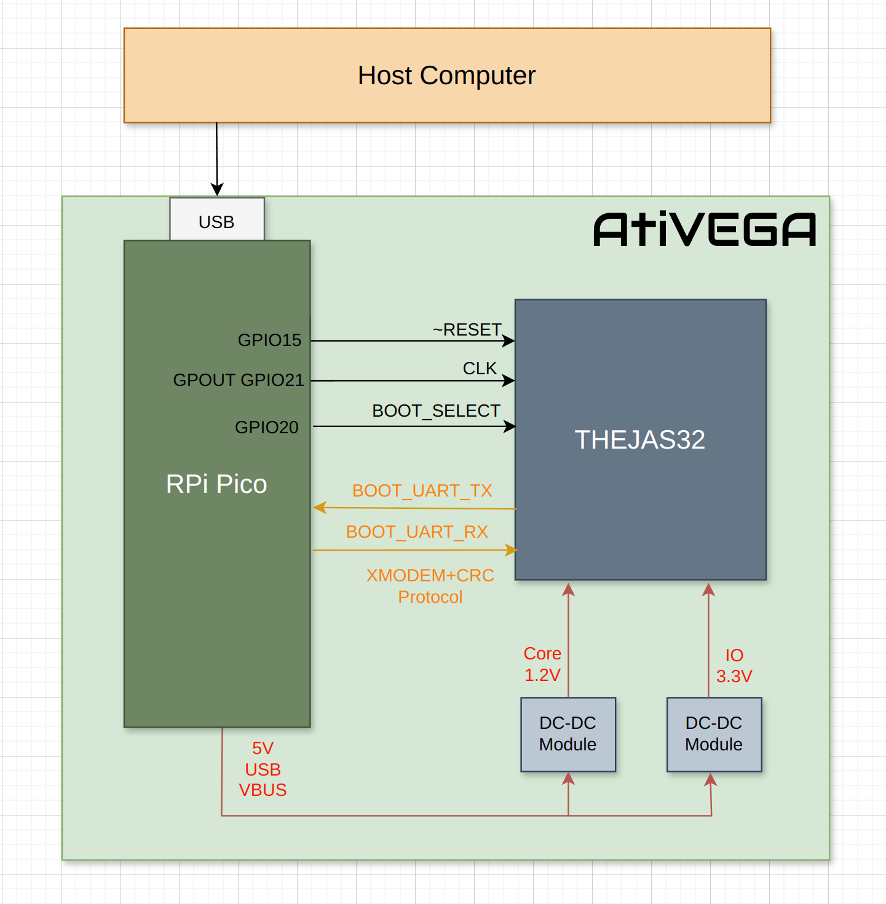
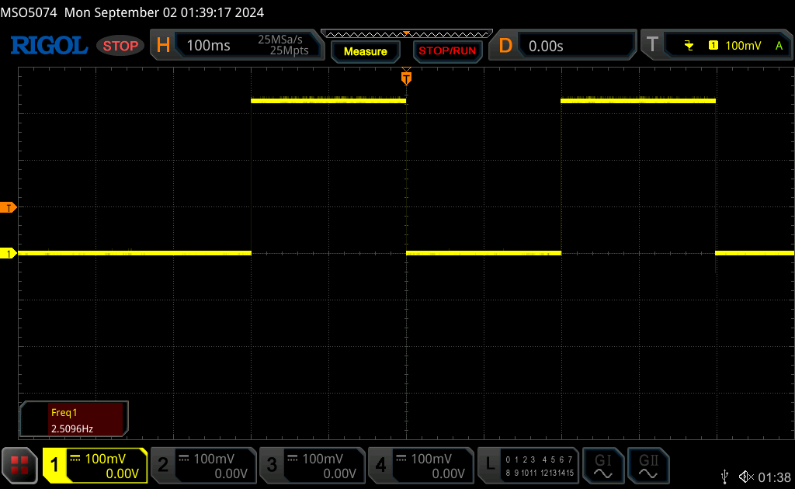

# Basic Power On Test

This sample does a basic power on the THEJAS32 on the AtiVEGA board.  The RP2040 microcontroller on the Pico serves as the driver.

## AtiVEGA Architecture

AtiVEGA includes the THEJAS32 microcontroller and a Raspberry Pi Pico.  

Typical microcontrollers use a medium frequency crystal (few MHz) as a clock source. They include an internal oscillator and PLL to boost this frequency manifold.  Raspeberry Pi Pico is based on the RP2040 microcontroller.  This microcontroller runs at 125 MHz or more, using a PLL running from a 12 MHz crystal.

Unlike the RP2040, THEJAS32 need an oscillator capable of driving a 3.3V clock! ARIES boards include a dedicated oscillator, part number [SIT8008AC-33-33E-100.000000](https://www.sitime.com/parts/sit8008ac-73-33e-100000000) for this purpose.  This generates the system clock for THEJAS32 - a fixed 100 MHz.  If we do include this part, we would adds to the cost and power consumption of AtiVEGA. We can do better than that.

Instead of a discrete oscillator, we use the a GPCLOCK pin of the RP2040 as the clock source.  This pin can be driven by the RP2040 at a very high speed. How fast ? At a maximum rate of the system clock of the RP2040. That's 125 MHz typical.  And more, if you overclock the microcontroller.

AtiVEGA also connect the RESET pin and BOOT_SELECT of THEJAS32 to RP2040 GPIO pins.  THEJAS32 checks tthe BOOT_SELECT pin on power up.  If it is low, the chip boots from the SPI flash.  If it is high, the chip boots from UART.  In either cases, THEJAS32 uses the boot UART to show the status and/or provide the option of uploading code.

Overall, THEJAS32 runtime life cycle is controlled by RP2040 in the Pico.  And hence, the entire lifecycle is software driven. And you can control it.  This sample shows how.

## Source Code

This is a Pico C/C++ SDK project.  When you build it, you will get poweron.uf2. Push it into the Pico to activate it.

poweron.c has all the power on steps mentioned below.  It is well commented. System clock is configured in CMakeLists.txt, which is also the build script for the project.

## Power On Method

Before powering on, first connect GPIO30 on header J10 to 3.3V with a jumper.  THEJAS32 uses this to configure the baud rate of the Boot UART interface.

Pico will restart and start running the code.  First, THEJAS32 is placed in reset by setting the GPIO low.  BOOT_SELECT line is pulled high to indicate UART boot. Then a 100 MHz clock is provided via GPIO21.  THEJAS32 is then taken out of reset, by setting the GPIO high.

In response, THEJAS32 boots.  First, it prints out a header. Then it waits for a software image over UART. This project does not implement the capability of uploading a software image.  Only basic booting is illustrated.

You can use your favourite terminal emulator (e.g. minicom) to look at the UART activity. If you see messages like below - then congratulations, you did everything right !

    =========================================================
    AtiVEGA ready to power-on THEJAS32
    Communicating with THEJAS32 at UART baud=195312
                                  (requested:195312)
    Powering on with clock=100000000 Hz _after_ 3 seconds!
    THEJAS32's boot log will follow after the next line
    =========================================================

    +-----------------------------------------------------------------------------+
    |           VEGA Series of Microprocessors Developed By C-DAC, INDIA          |
    |     Microprocessor Development Programme, Funded by MeitY, Govt. of India   |
    +-----------------------------------------------------------------------------+
    | Bootloader, ver 1.0.0 [  (hdg@cdac_tvm) Tue Dec  15 16:50:32 IST 2020 #135] |
    |                                                                             |
    |  ___    _________________________          ISA  : RISC-V [RV32IM]           |
    |  __ |  / /__  ____/_  ____/__    |                                          |
    |  __ | / /__  __/  _  / __ __  /| |         CPU  : VEGA ET1031               |
    |  __ |/ / _  /___  / /_/ / _  ___ |                                          |
    |  _____/  /_____/  \____/  /_/  |_|         SoC  : THEJAS32                  |
    +---------------------------------------+-------------------------------------+
    |         www.vegaprocessors.in         |             vega@cdac.in            |
    +---------------------------------------+-------------------------------------+

    Transfer mode  : UART XMODEM

    IRAM           : [0x200000 - 0x23E7FF] [250 KB]

    Please send file using XMODEM and then press ENTER key.

    ==> Ready to receive image 66275 microseconds after power on.
    ==> First char was received 6 microseconds after power on.

    CCCCCCCCCCCCCCCCCCCCCCCCCCCCCCCCCCCCCCCCCCCC

Note that the two lines beginning with "==>" are printed by this project's code.  Everything else above is output by THEJAS32 over UART.

## Slowing down THEJAS32

THEJAS32's clock speed can be *reduced* by changing T_CLK_DIV in poweron.c. A divider of 2 will run THEJAS32 at 50 MHz, 4 at 25 MHz, and 40 at 2.5 MHz.  Higher the divider, lower the execution speed.  You'll see the UART text slowly coming up as you increase the divider.  Note that changing the clock will indirectly change the UART baud rate as well.

How low can you go ?

## Overclocking THEJAS32

THEJAS32 is described as a 100 MHz RISC-V microcontroller.  But how fast can it really run ?

How about a cool 172 MHz ? Check CMakeLists.txt, rebuild, flash and enjoy!

## Monitoring the Heart Beat

THEJAS32 has a unique debugging feature - a HEART BEAT pin. CDAC's ARIES boards connect an LED to that.  AtiVEGA doesn't - we just route it to a pad on the board. This pin toggles at a very slow rate compared to the system clock - around 2.5 Hz with a 100 MHz system clock.  This is a 3.3V signal, and can be viewed with a simple logic analyzer (salea logic or clones) or an oscilloscope.

In hindsight, I should have made it at-least a through hole pin to make it easier to connect to the RP2040 with a jumper wire. Perhaps in the second revision....

## Lab Exercises

Work out these...

 1. What's the slowest clock speed at which you can run THEJAS32 ?
 2. What is the fastest clock speed at which you can run THEJAS32 ?
 3. Do you see UART messages at the slowest/fastest clock rate you were able to manage ? If not, why not ? And how would you fix the program to see the messages ?
 4. I suspect there is a constant relationship (divider) between THEJAS32 clock and the HEART BEAT signal. Can you find this ? Is this the same across boards ?
 5. What is the power consumption of only the THEJAS32 ? How does it relate to the clock speed ?

# One Last Thing!

If you don't connect GPIO30 to 3.3V, there is a good chance you won't see any messages on UART.  This is required due to an annoying design decision taken by whoever designed the bootloader of the THEJAS32 (and burnt it into ROM!).

The bootloader samples a whopping 7 GPIOs - GPIO31 to GPIO25.  Essentially, this is converted to a divider in the range 0 to 127.  The bootloader configures a UART baud rate equal to Sytem Clock/(16 x value). The ARIES boards pull up/down these GPIOs to set a baud rate of 115200.  Unfortunately, AtiVEGA doesn't.  So, if you don't connect a jumper, the divisor could become 0, effectively disabling UART messages. It can be really confusing when that happens. So, do populate the jumper.  With that, the bootloader will *mostly* set a baud rate of 195312.  There I said it, *mostly* !

Even with the jumper, on rare occasions, you won't see any messages coming from THEJAS32.  As the other GPIOs are "floating" rather than pulled down, there is a chance that THEJAS32 will sample one or more of them as high.  This will result in actual baud rate selected by THEJAS32 to be very different than what the RP2040 thinks it is.  Due to the baud rate mismatch, you won't see the messages.

Without spinning the board, hwo can this be handled ? Can you think of a scheme to automagically detect the baud rate of THEJAS32 from the RP2040 ? The good news is yes, you can. Look at the poweron_autobaud bringup sample for details.